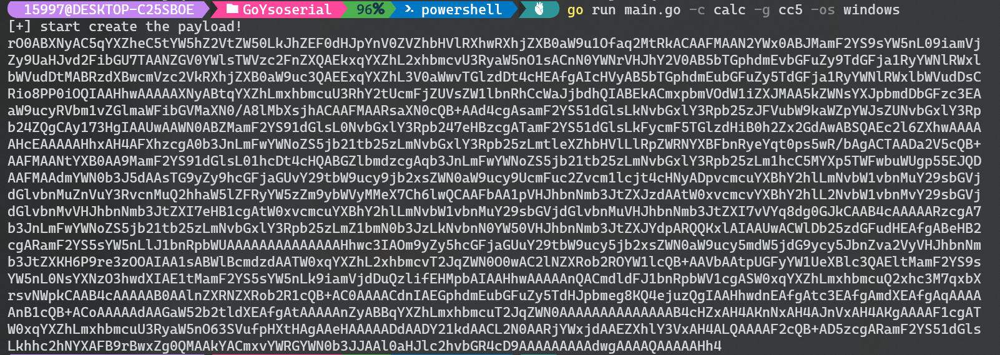
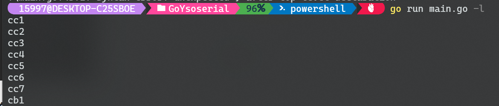

# GoYsoserial

## About

GoYsoserial是使用Go语言开发的类似ysoserial的工具，支持CC1-CC7和CB的反序列化链POC，区分windows和linux的命令执行。

由于不会写Go也没怎么写过安全工具，所以代码质量会比较差，后续可能会进行优化，也会逐渐增加反序列化链的POC和修改可能存在的bug。

## 使用

```
  -c string
        the cmd you want execute
  -g string                                                   
        the gadget you select                                 
  -h    show the help                                         
  -l    list all the gadget name                              
  -os string                                                  
        the operate system you want to attack,windows or linux


```

例子：

```
 go run main.go -c calc -g cc5 -os windows
```

即可生成cc5的链，可以在windows环境下执行calc命令，因为区分了`cmd /c`和`/bin/sh -c`。




目前的支持链：




## 最后

**欢迎stars!**